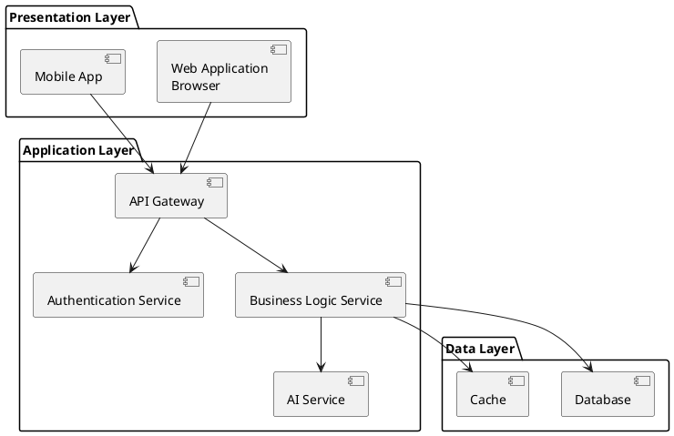
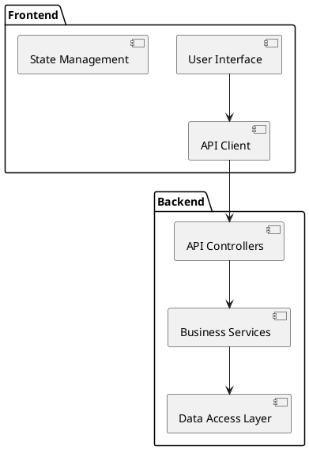
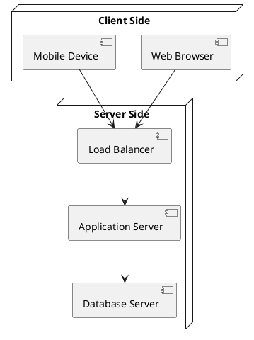
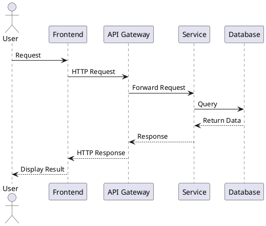
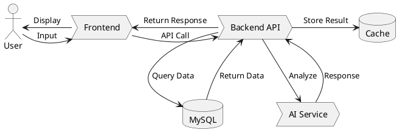

# HLD Document Generator

## Overview

This skill enables generation of comprehensive High-Level Design (HLD) documents based on existing SRS requirements and project code analysis. It produces structured design documentation following standard HLD template formats with architecture diagrams, component specifications, and technical details.

## When to Use

- Generating HLD documents from completed SRS specifications
- Creating detailed design documentation for existing projects
- Documenting system architecture and component design
- Preparing technical design specifications for development teams

## Workflow

```
+----------------+     +-------------------+     +----------------+
|  Read SRS    | --> |  Analyze Code   | --> | Generate HLD  |
|  Document     |     |  Structure     |     |  Document     |
+----------------+     +-------------------+     +----------------+
                                                          |
                                                          v
                                                  +----------------+
                                                  |  Add PlantUML  |
                                                  |  Diagrams      |
                                                  +----------------+
```

## Step 1: Read and Analyze Inputs

### Required Inputs

1. **SRS Document**: Read the existing SRS document to understand:
   - Functional requirements
   - Non-functional requirements
   - System constraints
   - Data models and interfaces

2. **Project Code**: Analyze the codebase to understand:
   - Current implementation
   - Technology stack
   - Architecture patterns
   - Database schema
   - API endpoints

### Key Analysis Areas

| Area | What to Extract | Source |
|------|---------------|--------|
| System Architecture | Architecture diagram, tiers, deployment pattern | SRS + Code |
| Components | Modules, services, libraries | Code structure |
| Data Models | Database tables, relationships | SRS data dictionary |
| API Design | Endpoints, protocols, data formats | API routes |
| Security | Authentication, encryption, access control | SRS + Code |

## Step 2: HLD Document Structure

Generate HLD document with following structure:

### 1. Introduction
- 1.1 Purpose
- 1.2 Scope
- 1.3 Definitions, Acronyms, and Abbreviations
- 1.4 References

### 2. Overall Description
- 2.1 Product Perspective
- 2.2 Product Functions
- 2.3 User Characteristics
- 2.4 Constraints
- 2.5 Assumptions and Dependencies

### 3. System Architecture
- 3.1 Architecture Overview
- 3.2 System Design Principles
- 3.3 Technology Stack
- 3.4 Architecture Diagrams (PlantUML)

### 4. Component Design
- 4.1 Frontend Components
- 4.2 Backend Components
- 4.3 Database Components
- 4.4 External Services Integration
- 4.5 Component Interactions (PlantUML)

### 5. Data Design
- 5.1 Data Models
- 5.2 Database Schema
- 5.3 Data Flow (PlantUML)
- 5.4 Caching Strategy

### 6. Interface Design
- 6.1 User Interfaces
- 6.2 API Interfaces
- 6.3 Third-Party Interfaces

### 7. Security Design
- 7.1 Authentication and Authorization
- 7.2 Data Encryption
- 7.3 Input Validation
- 7.4 Security Protocols

### 8. Non-Functional Requirements
- 8.1 Performance Requirements
- 8.2 Scalability
- 8.3 Reliability
- 8.4 Availability

### 9. Deployment Architecture
- 9.1 Deployment Environment
- 9.2 Infrastructure Requirements
- 9.3 Deployment Diagram (PlantUML)

### 10. Appendices
- 10.1 Architecture Diagrams
- 10.2 Component Diagrams
- 10.3 Sequence Diagrams
- 10.4 Data Dictionary

## Step 3: Generate PlantUML Diagrams

### Architecture Diagram Template



### Component Diagram Template



### Deployment Diagram Template



### Sequence Diagram Template



### Data Flow Diagram Template



## Step 4: Technology Stack Documentation

### Document Each Layer

| Layer | Technology | Version | Purpose |
|-------|-----------|---------|---------|
| Frontend | HTML5, JavaScript, ECharts | - | User interface |
| Backend | FastAPI, Python 3.10+ | - | API and business logic |
| Database | MySQL 8.0 | - | Data persistence |
| AI | Baidu Ernie / ChatGLM | - | LLM integration |

### Configuration Management

- **Development**: Local environment with Docker Compose
- **Testing**: Dedicated test database
- **Production**: Cloud deployment with load balancing

## Step 5: Generate HLD Document

### Output File Naming

Generate document as: `[ProjectName]_HLD_v[X.X].md`

### Content Guidelines

1. **Be Specific**: Include actual component names, ports, protocols
2. **Show Relationships**: Use PlantUML to show interactions
3. **Document Decisions**: Explain architectural choices
4. **Include Constraints**: List technical constraints and limitations
5. **Reference SRS**: Cross-reference requirements from SRS document

### Example HLD Output Structure

```markdown
# [Project Name] - High-Level Design Document

## 1. Introduction

### 1.1 Purpose
This document describes the high-level design of [Project Name], including system architecture, component design, data models, and technical specifications.

### 1.2 Scope
The system includes [list major components and their scope].

...

## 2. Overall Description

...

## 3. System Architecture

### 3.1 Architecture Overview
[Include architecture diagram and description]

### 3.2 Architecture Principles
[List design principles: scalability, maintainability, security, etc.]

...

[Continue with all sections]
```

## Quick Reference

### HLD vs SRS

| Aspect | SRS | HLD |
|--------|-----|-----|
| Focus | What to build | How to build |
| Audience | Stakeholders, PMs | Developers, Architects |
| Content | Requirements, features | Architecture, components, design |
| Diagrams | Use cases, flows | Component, deployment diagrams |

### Common HLD Patterns

| Pattern | Description | When to Use |
|---------|-------------|--------------|
| Layered Architecture | 3-tier: Presentation, Business, Data | Most web applications |
| Microservices | Independent services with APIs | Large-scale systems |
| Event-Driven | Async message-based communication | Real-time systems |
| Monolithic | Single deployed unit | Simple applications |

## Common Mistakes

### ❌ Too High-Level
- Bad: "The system has a frontend and backend"
- Good: "Frontend uses React, communicates with FastAPI backend via REST at port 8092"

### ❌ Missing Diagrams
- Always include PlantUML diagrams for architecture, components, deployment
- Diagrams should be detailed and show actual component names

### ❌ Ignoring Constraints
- Always document technical, operational, and business constraints
- Explain how constraints influence design decisions

### ❌ No Technology Details
- Include specific technologies, versions, configurations
- Document why technologies were chosen

## Verification Checklist

- [ ] All SRS requirements addressed in design
- [ ] Architecture diagram shows all major components
- [ ] Component diagram shows interactions
- [ ] Data models match database schema
- [ ] API specifications documented
- [ ] Security measures described
- [ ] Performance considerations addressed
- [ ] Deployment architecture documented
- [ ] All PlantUML diagrams are valid
- [ ] Technology stack fully specified
- [ ] Cross-references to SRS included
