# HLD Document Template

## Standard HLD Document Structure

This template follows industry-standard HLD documentation format for software system design.

---

# [Project Name] - High-Level Design (HLD) Document

**Document Version**: v1.0  
**Date**: [YYYY-MM-DD]  
**Author**: [Author Name]  
**Status**: [Draft/Review/Approved]

---

## Revision History

| Version | Date | Author | Description |
|---------|-------|--------|-------------|
| 1.0 | [Date] | [Author] | Initial HLD document |

---

## 1. Introduction

### 1.1 Purpose

This document provides a comprehensive high-level design specification for the [Project Name] system. It describes the system architecture, component design, data structures, interfaces, and deployment strategy to guide development and implementation.

### 1.2 Scope

The HLD document covers:

- System architecture and design principles
- Component breakdown and interactions
- Database design and data flow
- Interface specifications
- Security and performance considerations
- Deployment architecture

**Out of Scope**:
- Detailed implementation code
- Low-level algorithms
- Unit test specifications

### 1.3 Definitions, Acronyms, and Abbreviations

| Term/Acronym | Definition |
|--------------|------------|
| HLD | High-Level Design |
| API | Application Programming Interface |
| LLM | Large Language Model |
| SRS | Software Requirements Specification |
| CBT | Cognitive Behavioral Therapy |

### 1.4 References

- [Project Name] SRS Document v[X.X]
- Technology Stack Documentation
- Architecture Standards and Guidelines
- Security Best Practices Document

---

## 2. Overall Description

### 2.1 Product Perspective

[Describe where the product fits in the system landscape, including external systems and dependencies.]

### 2.2 Product Functions

[Briefly describe major functions, referencing SRS requirements.]

| Function | SRS Requirement ID | Description |
|----------|-------------------|-------------|
| User Authentication | REQ-AUTH-001 to REQ-AUTH-005 | User login, registration, token management |
| AI Chat | REQ-CHAT-001 to REQ-CHAT-003 | Real-time AI-powered conversation |
| Emotion Analysis | REQ-EMOTION-001 to REQ-EMOTION-005 | Multi-modal emotion recognition |

### 2.3 User Characteristics

| User Type | Description | Access Level |
|-----------|-------------|--------------|
| End User | 18-35 year olds seeking emotional support | Standard |
| Administrator | System operators and managers | Admin |
| Counselor | Professional therapists | Consultant |

### 2.4 Constraints

#### Technical Constraints
- [List technical limitations]
- [Platform requirements]
- [Compatibility requirements]

#### Operational Constraints
- [System availability requirements]
- [Maintenance windows]
- [Backup and recovery requirements]

#### Business Constraints
- [Budget limitations]
- [Timeline constraints]
- [Regulatory requirements]

### 2.5 Assumptions and Dependencies

#### Assumptions
- [Assumption 1]
- [Assumption 2]

#### Dependencies
- [External API dependencies]
- [Third-party services]
- [Infrastructure dependencies]

---

## 3. System Architecture

### 3.1 Architecture Overview

[Insert Architecture Diagram]

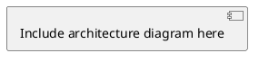

**Architecture Description**:

[Describe the overall architecture approach, layers, and key design decisions.]

### 3.2 System Design Principles

| Principle | Description | Application |
|-----------|-------------|-------------|
| Separation of Concerns | Clear separation between presentation, business, and data layers | Implemented through tiered architecture |
| Scalability | System can handle increased load | Horizontal scaling via load balancer |
| Maintainability | Easy to modify and extend | Modular component design |
| Security | Protection of user data and system access | Authentication, encryption, access control |

### 3.3 Technology Stack

| Layer | Technology | Version | Rationale |
|-------|-----------|---------|-----------|
| Frontend | HTML5, JavaScript, ECharts | - | Lightweight, cross-platform |
| Backend | FastAPI, Python 3.10+ | - | Fast, async, modern |
| Database | MySQL 8.0 | - | Mature, reliable |
| AI Integration | Baidu Ernie / ChatGLM | - | Chinese language support |

### 3.4 Architecture Diagrams

#### 3.4.1 High-Level Architecture

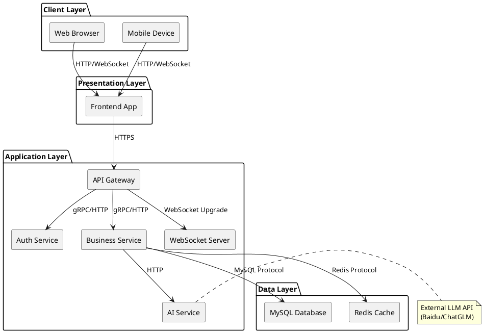

#### 3.4.2 Layered Architecture

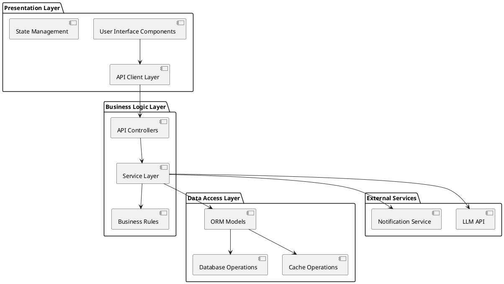

---

## 4. Component Design

### 4.1 Frontend Components

| Component | Description | Technology | Responsibilities |
|-----------|-------------|------------|-----------------|
| Chat Interface | Real-time conversation UI | HTML/JS | Message display, input handling |
| Emotion Dashboard | Visualize emotion trends | ECharts | Charts, analytics |
| User Profile | User information display | HTML/JS | Profile management |
| Diary Module | Emotion diary management | HTML/JS | CRUD operations |

### 4.2 Backend Components

| Component | Description | Technology | API Endpoints |
|-----------|-------------|------------|---------------|
| Auth Service | Authentication and authorization | FastAPI | /api/auth/* |
| Chat Service | AI conversation handling | FastAPI | /api/chat/* |
| Emotion Service | Emotion analysis and reporting | FastAPI | /api/emotion/* |
| Plan Service | Healing plan management | FastAPI | /api/plans/* |

### 4.3 Database Components

| Component | Description | Tables |
|-----------|-------------|---------|
| User Storage | User data and authentication | user, user_token |
| Chat Storage | Conversation history | chat_record |
| Emotion Storage | Emotion logs and analysis | emotion_log |

### 4.4 External Services Integration

| Service | Purpose | Protocol | SLA |
|---------|---------|----------|-----|
| Baidu Ernie API | LLM inference | HTTPS | < 5s response |
| Email Service | Crisis notifications | SMTP | 24h delivery |

### 4.5 Component Interactions

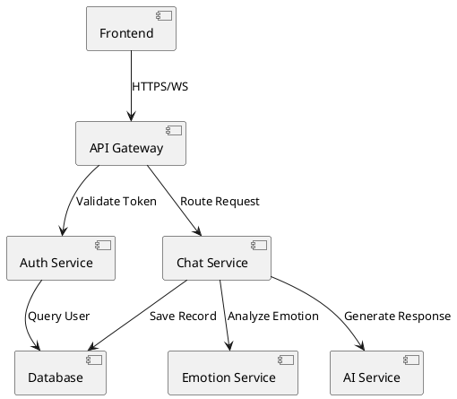

---

## 5. Data Design

### 5.1 Data Models

[Describe data entities and their relationships.]

### 5.2 Database Schema

[Include detailed database schema or reference to SRS data dictionary.]

### 5.3 Data Flow

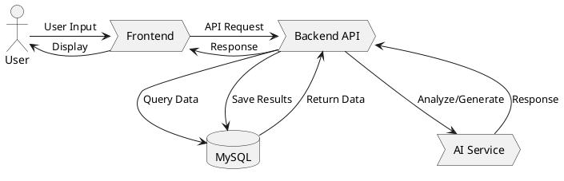

### 5.4 Caching Strategy

| Cache Type | Use Case | TTL | Invalidation Strategy |
|-----------|----------|-----|-------------------|
| User Session | Login state | 7 days | On logout |
| API Responses | Frequently accessed data | 5 min | On data update |
| Emotion Trends | Dashboard data | 1 hour | On new log entry |

---

## 6. Interface Design

### 6.1 User Interfaces

| Interface | Description | Access Method |
|----------|-------------|--------------|
| Web Dashboard | Main user interface | HTTPS://domain/ |
| Login Page | Authentication | HTTPS://domain/#login |
| API Documentation | Swagger UI | HTTPS://domain/docs |

### 6.2 API Interfaces

#### REST API Specifications

| Endpoint | Method | Auth | Description |
|----------|--------|------|-------------|
| /api/auth/login | POST | No | User login |
| /api/chat/send | POST | Yes | Send chat message |
| /api/emotion/report | GET | Yes | Get emotion report |

#### WebSocket Interfaces

| Endpoint | Purpose | Authentication |
|----------|---------|---------------|
| /ws/chat | Real-time chat | Token in query parameter |

### 6.3 Third-Party Interfaces

| Interface | Protocol | Purpose |
|----------|---------|---------|
| Baidu Ernie API | HTTPS | LLM inference |

---

## 7. Security Design

### 7.1 Authentication and Authorization

#### Authentication Flow

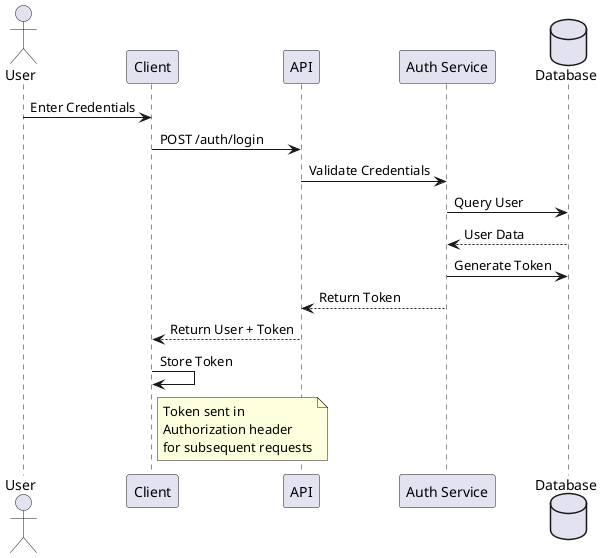

#### Security Mechanisms

| Mechanism | Description | Implementation |
|-----------|-------------|----------------|
| Password Hashing | SHA256 with salt | bcrypt algorithm |
| JWT Token | Stateless authentication | 7-day expiration |
| Rate Limiting | Prevent abuse | 100 req/min |

### 7.2 Data Encryption

| Data Type | Encryption Method | Storage |
|-----------|-----------------|---------|
| Password | SHA256 + Salt | Hashed |
| Sensitive Fields | AES-256 | Encrypted in DB |

### 7.3 Input Validation

| Layer | Validation Type | Rules |
|-------|---------------|-------|
| Frontend | Client-side validation | Required fields, format checks |
| Backend | Server-side validation | Schema validation, SQL injection prevention |
| Database | Constraint validation | Foreign keys, data types |

### 7.4 Security Protocols

| Protocol | Usage | Configuration |
|----------|--------|--------------|
| HTTPS | All client communication | TLS 1.3 |
| WSS | WebSocket connections | TLS 1.3 |

---

## 8. Non-Functional Requirements

### 8.1 Performance Requirements

| Metric | Target | Measurement |
|--------|--------|-------------|
| API Response Time | < 500ms | p95 |
| Page Load Time | < 3s | p95 |
| AI Response Time | < 5s | p95 |
| Concurrent Users | 100+ | Steady state |

### 8.2 Scalability

| Aspect | Design | Target |
|--------|--------|--------|
| Horizontal Scaling | Stateless services | 10x capacity |
| Database | Read replicas | 5x read capacity |
| Caching | Redis cluster | 80% cache hit rate |

### 8.3 Reliability

| Metric | Target | Strategy |
|--------|--------|----------|
| System Availability | 99.5% | Redundancy, monitoring |
| Data Durability | 99.9% | Replication, backups |
| MTTR | < 15 min | Automated recovery |

### 8.4 Availability

| System | Uptime Target | Maintenance Window |
|---------|--------------|------------------|
| Application | 99.5% | 4 hours/month |
| Database | 99.9% | 2 hours/month |

---

## 9. Deployment Architecture

### 9.1 Deployment Environment

#### Development Environment

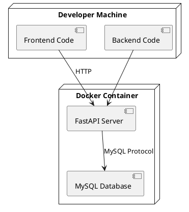

#### Production Environment

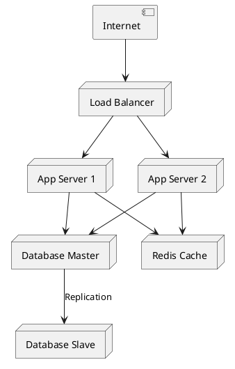

### 9.2 Infrastructure Requirements

| Component | Specifications | Quantity |
|-----------|----------------|-----------|
| Application Server | 4 CPU, 8GB RAM | 2+ (HA) |
| Database Server | 8 CPU, 16GB RAM, SSD | 2 (Master + Slave) |
| Load Balancer | 4 CPU, 4GB RAM | 1 (HA pair) |
| Storage | 100GB SSD | RAID 10 |

### 9.3 Deployment Diagram

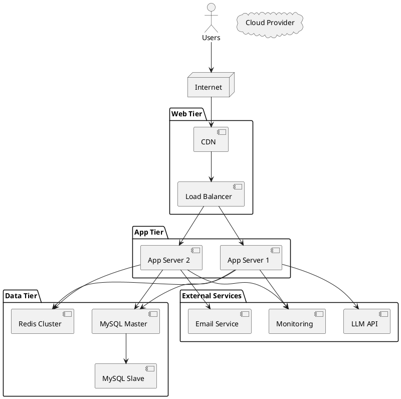

---

## 10. Appendices

### 10.1 Architecture Diagrams

[Additional detailed diagrams]

### 10.2 Component Diagrams

[Component-level diagrams]

### 10.3 Sequence Diagrams

#### User Login Sequence

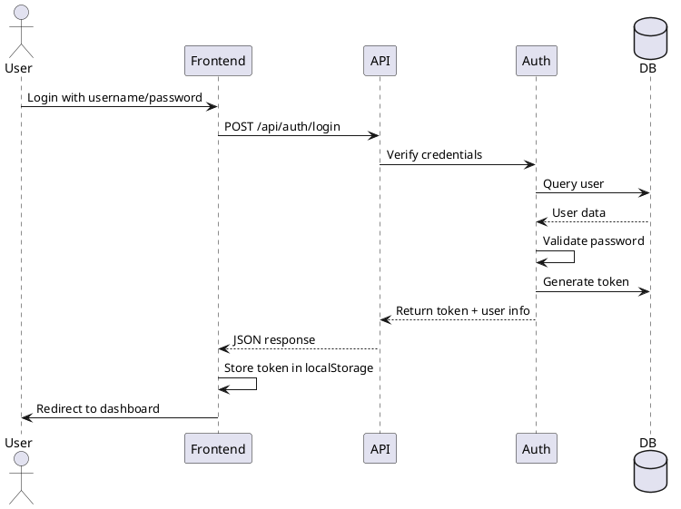

#### Chat Conversation Sequence

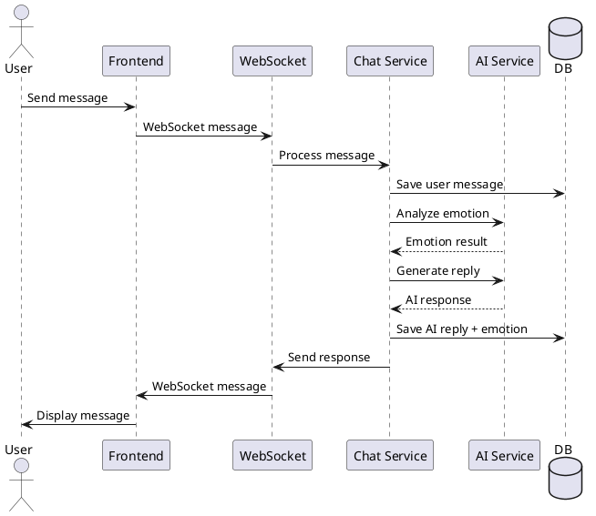

### 10.4 Data Dictionary

[Reference to SRS data dictionary section]

---

## Approval

| Role | Name | Signature | Date |
|-------|-------|-----------|------|
| Author | | | |
| Technical Reviewer | | | |
| Architecture Reviewer | | | |
| Project Manager | | | |

---

**Document Control**

- **Document Owner**: [Owner Name]
- **Next Review Date**: [Date]
- **Distribution List**: [List of recipients]
