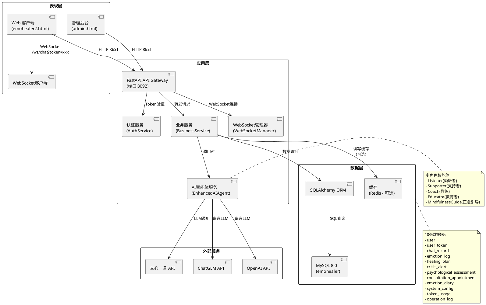
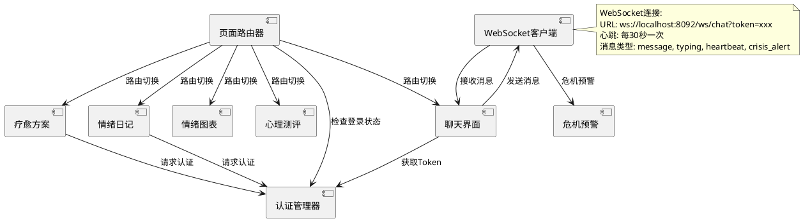
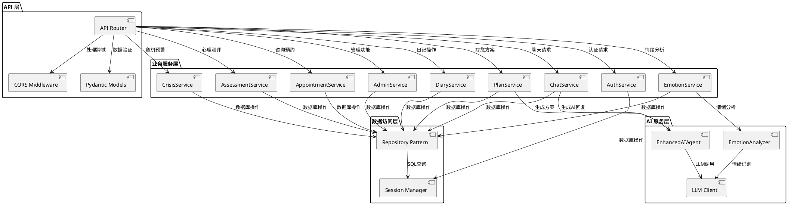
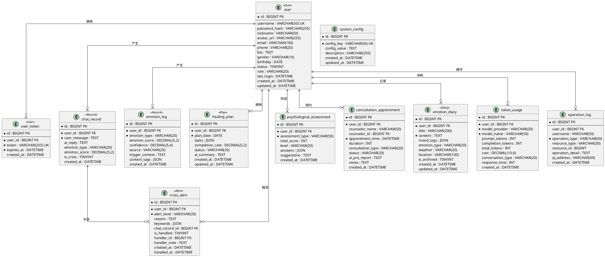
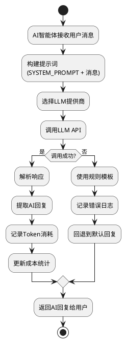
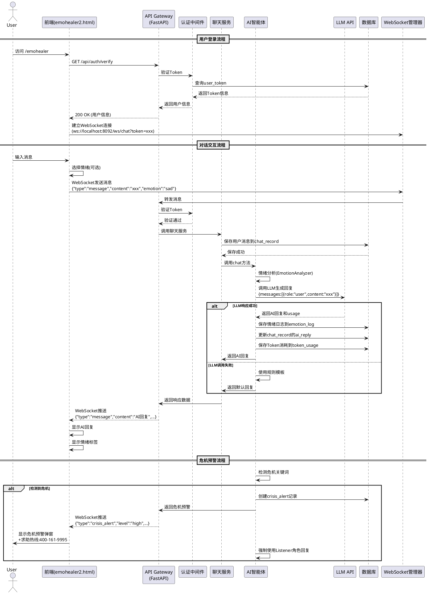
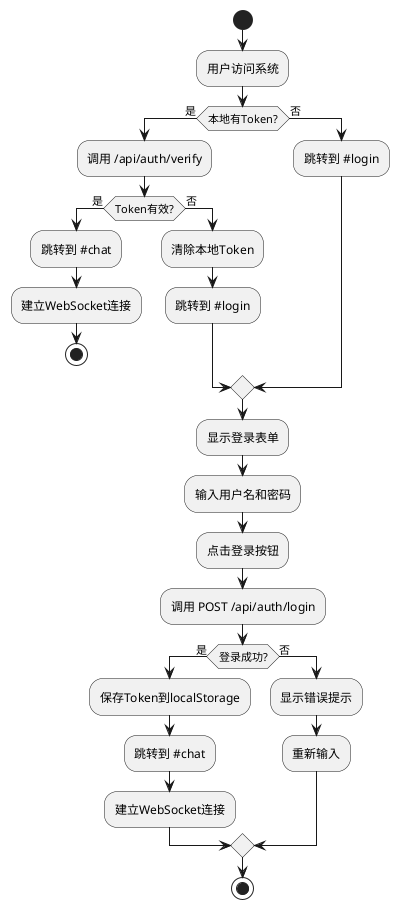
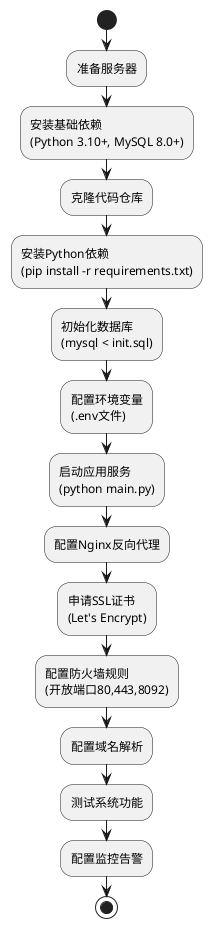

# EmoHealer 情绪疗愈平台 - 高层设计文档 (HLD)

## 文档信息
- **项目名称**: EmoHealer AI 情绪疗愈平台
- **文档版本**: v1.0
- **创建日期**: 2026-03-19
- **作者**: 基于 EmoHealer 项目代码分析生成
- **对应 SRS**: EmoHealer_功能需求文档.md

---

## 目录

1. [简介](#1-简介)
2. [总体描述](#2-总体描述)
3. [系统架构](#3-系统架构)
4. [组件设计](#4-组件设计)
5. [数据设计](#5-数据设计)
6. [接口设计](#6-接口设计)
7. [安全设计](#7-安全设计)
8. [非功能需求](#8-非功能需求)
9. [部署架构](#9-部署架构)
10. [附录](#10-附录)

---

## 1. 简介

### 1.1 目的

本文档描述 EmoHealer 情绪疗愈平台的高层设计,包括系统架构、组件设计、数据模型和技术规范。HLD 文档旨在为开发团队、架构师和技术决策者提供系统的技术设计指导。

### 1.2 范围

EmoHealer 是一个基于 AIGC(人工智能生成内容)技术的情绪疗愈平台,为 18-35 岁用户提供 7×24 小时专业且温暖的情绪支持服务。系统包括以下核心组件:

- 用户认证与管理模块
- AI 智能对话系统(基于 CBT 认知行为疗法)
- 多模态情绪识别(文本、语音、表情)
- 个性化疗愈方案生成
- 情绪日记与数据分析
- 危机预警与干预机制
- 心理测评与咨询师预约
- 系统管理后台

### 1.3 定义、缩写和术语

| 术语/缩写 | 全称/定义 |
|------------|-----------|
| HLD | High-Level Design (高层设计) |
| SRS | Software Requirements Specification (软件需求规格说明书) |
| CBT | Cognitive Behavioral Therapy (认知行为疗法) |
| LLM | Large Language Model (大语言模型) |
| RAG | Retrieval-Augmented Generation (检索增强生成) |
| MVP | Minimum Viable Product (最小可行产品) |
| API | Application Programming Interface (应用程序接口) |
| REST | Representational State Transfer (表述性状态转移) |
| ORM | Object-Relational Mapping (对象关系映射) |
| CORS | Cross-Origin Resource Sharing (跨域资源共享) |
| Docker | 容器化平台 |
| SQLAlchemy | Python ORM 框架 |
| Pydantic | Python 数据验证库 |
| ECharts | Enterprise Charts (商业级图表库) |

### 1.4 参考文献

1. EmoHealer 软件需求规格说明书 (SRS)
2. FastAPI 官方文档: https://fastapi.tiangolo.com/
3. SQLAlchemy 文档: https://docs.sqlalchemy.org/
4. WebSocket 协议规范: RFC 6455
5. MySQL 8.0 参考手册
6. Docker 官方文档
7. 心理健康服务相关法律法规

---

## 2. 总体描述

### 2.1 产品视角

EmoHealer 采用前后端分离的三层架构:

1. **表现层 (Presentation Layer)**: 
   - Web 浏览器客户端
   - 响应式 HTML5/JavaScript 界面
   - ECharts 数据可视化组件
   - WebSocket 实时通信客户端

2. **应用层 (Application Layer)**:
   - FastAPI RESTful API 服务
   - WebSocket 实时通信服务
   - AI 智能体服务(多角色 LLM 集成)
   - 业务逻辑处理服务
   - 认证与授权服务

3. **数据层 (Data Layer)**:
   - MySQL 8.0 关系型数据库
   - SQLAlchemy ORM 数据访问层
   - 数据缓存策略(可选 Redis)

### 2.2 产品功能

系统提供以下核心功能(对应 SRS 需求):

| 功能模块 | 功能描述 | 优先级 |
|---------|---------|--------|
| 用户认证 | 注册、登录、登出、Token 管理、密码修改 | 高 |
| AI 对话 | 智能对话、情绪识别、危机检测、多角色回复 | 高 |
| 情绪分析 | 文本/语音/表情情绪识别、情绪趋势分析、情绪报告 | 高 |
| 疗愈方案 | AI 生成个性化方案、任务执行、完成率统计 | 中 |
| 情绪日记 | 创建、查询、更新、删除日记(软删除) | 中 |
| 危机预警 | 关键词检测、预警级别评估、管理员处理 | 高 |
| 心理测评 | PHQ-9/GAD-7 测评提交、历史查询 | 中 |
| 咨询预约 | 提交预约、预约列表、状态管理 | 中 |
| 系统管理 | 数据驾驶舱、用户管理、Token 统计、操作日志 | 中 |

### 2.3 用户特征

| 用户类型 | 特征描述 | 需求 | 使用场景 |
|---------|---------|--------|---------|
| 普通用户 | 18-35岁,面临工作压力、情感困扰、情绪管理需求 | 完整功能访问 | 随时访问、移动友好、隐私保护 |
| 管理员 | 负责系统运维、数据监控、危机处理 | 管理权限 | 数据看板、危机预警处理 |
| 咨询师 | 接受预约,提供专业心理咨询 | 预约管理 | 查看预约、提供咨询 |

### 2.4 约束条件

#### 技术约束

| 约束项 | 约束描述 |
|---------|---------|
| 浏览器兼容性 | 需支持 Chrome 80+、Firefox 75+、Edge 80+ |
| 数据库 | 必须使用 MySQL 8.0+,支持 InnoDB 引擎 |
| Python 版本 | 后端需要 Python 3.10+ |
| API 版本 | RESTful API 遵循 HTTP/1.1 规范 |
| WebSocket | 必须支持 RFC 6455 协议 |
| LLM 响应时间 | AI 对话响应时间 < 5 秒 |

#### 业务约束

| 约束项 | 约束描述 |
|---------|---------|
| Token 有效期 | 访问 Token 有效期为 7 天 |
| 每日对话限制 | 每日最多 100 次对话 |
| 密码加密 | 必须使用 SHA256 加密存储(带盐值) |
| 数据隔离 | 用户数据严格隔离,无法访问其他用户数据 |
| 危机响应 | 检测到危机必须在 1 秒内推送预警 |

#### 运维约束

| 约束项 | 约束描述 |
|---------|---------|
| 系统可用性 | ≥ 99.5% |
| 故障恢复时间 | < 15 分钟 |
| 数据备份频率 | 每日备份 |
| 日志保留 | 操作日志保留 90 天 |

### 2.5 假设和依赖

#### 技术假设

1. **AI 服务可用性**: 假设能够稳定访问外部 LLM API(文心一言/ChatGLM/OpenAI)
2. **网络环境**: 用户网络能够访问 WebSocket 和 HTTPS
3. **数据库性能**: MySQL 数据库能够支持 100+ 并发查询
4. **浏览器支持**: 客户端浏览器支持 WebSocket 和现代 JavaScript 特性
5. **AI 模型响应**: LLM 响应时间在可接受范围内(< 5 秒)

#### 依赖项

| 依赖项 | 版本/说明 | 用途 |
|--------|-----------|------|
| Python | 3.10+ | 后端运行环境 |
| FastAPI | 0.104.0+ | Web 框架 |
| SQLAlchemy | 2.0+ | ORM 框架 |
| PyMySQL | 1.1.0+ | MySQL 数据库驱动 |
| Pydantic | 2.0+ | 数据验证 |
| uvicorn | 0.23.0+ | ASGI 服务器 |
| MySQL | 8.0+ | 数据库 |
| ECharts | 5.4+ | 前端图表库 |
| Docker | 20.10+ | 容器化部署 |
| 文心一言 API | - | LLM 服务 |
| Web Speech API | - | 语音识别 |

---

## 3. 系统架构

### 3.1 架构概览

EmoHealer 采用经典的三层架构(Tiered Architecture),结合微服务理念:

```
┌─────────────────────────────────────────────────────────────────┐
│                     表现层 (Presentation Layer)                │
│  ┌──────────┐  ┌──────────┐  ┌──────────┐          │
│  │ Web 客户端 │  │ 移动端  │  │ 管理后台  │          │
│  └──────────┘  └──────────┘  └──────────┘          │
└────────────────────┬────────────────────────────────────────┘
                     │ HTTP/WebSocket
┌────────────────────┴────────────────────────────────────────┐
│                   应用层 (Application Layer)                 │
│  ┌──────────────────────────────────────────────┐        │
│  │         FastAPI API Gateway                │        │
│  └────────┬────────┬────────┬───────────────┘        │
│           │        │        │                           │
│  ┌────────▼──┐ ┌─▼──────┐ ┌─▼─────────────┐ │
│  │认证服务   │ │业务服务 │ │AI 智能体服务 │ │
│  └───────────┘ └────────┘ └──────────────┘ │
│  ┌──────────────────────────────────────────┐         │
│  │      WebSocket 管理器                │         │
│  └──────────────────────────────────────────┘         │
└────────────────────┬─────────────────────────────────┘
                     │ SQL
┌────────────────────┴─────────────────────────────────┐
│                    数据层 (Data Layer)                   │
│  ┌────────────────┐    ┌──────────────┐          │
│  │ MySQL 8.0     │    │ 缓存(可选)    │          │
│  │ - InnoDB引擎   │    │ - Redis      │          │
│  │ - 主从复制    │    └──────────────┘          │
│  └────────────────┘                                  │
└─────────────────────────────────────────────────────────────┘
         ▲               ▲
         │               │
    ┌────┘               └─────┐
    │ LLM API                 │
    └─────────────────────────┘
```

#### 架构说明

1. **表现层**: 负责用户交互和界面展示
   - Web 客户端: 通过浏览器访问 http://localhost:8092/emohealer
   - 管理后台: 通过 /admin 路径访问
   - 使用 WebSocket 实现实时双向通信

2. **应用层**: 负责业务逻辑处理和 API 服务
   - API Gateway: 统一入口,处理 CORS、认证
   - 认证服务: 用户注册/登录/Token 验证
   - 业务服务: 对话、情绪分析、疗愈方案等
   - AI 服务: 集成 LLM,多角色智能体
   - WebSocket 管理器: 实时消息推送

3. **数据层**: 负责数据持久化和查询
   - MySQL 8.0: 主数据存储
   - 可选 Redis: 缓存热点数据

4. **外部服务**: LLM API 集成
   - 文心一言: 百度提供的 LLM 服务
   - ChatGLM: 智谱 AI 提供的 LLM 服务
   - OpenAI: 备选 LLM 服务

### 3.2 系统架构图 (PlantUML)



### 3.3 系统设计原则

| 设计原则 | 说明 | 应用场景 |
|---------|------|---------|
| **关注点分离** | 表现层、应用层、数据层职责明确 | 整体架构设计 |
| **单一职责** | 每个组件只负责一个功能领域 | 服务模块划分 |
| **开闭原则** | 对扩展开放,对修改关闭 | AI 服务可替换 |
| **依赖倒置** | 依赖抽象而非具体实现 | ORM 抽象层 |
| **RESTful 设计** | 使用标准 HTTP 方法和状态码 | API 设计 |
| **安全优先** | 认证、加密、输入验证贯穿全层 | 安全设计 |
| **可扩展性** | 支持横向扩展,增加服务器实例 | 部署架构 |
| **高可用性** | 无单点故障,支持故障恢复 | 部署和运维 |
| **用户数据隔离** | 严格的数据权限控制 | 数据访问层 |

### 3.4 技术栈

#### 完整技术栈

| 层次 | 技术 | 版本 | 说明 |
|------|------|------|------|
| **表现层** | | |
| HTML/CSS/JavaScript | - | 标准前端技术 |
| ECharts | 5.4+ | 数据可视化图表库 |
| Web Speech API | - | 浏览器语音识别 API |
| WebSocket | RFC 6455 | 实时通信协议 |
| **应用层** | | |
| Python | 3.10+ | 后端编程语言 |
| FastAPI | 0.104.0+ | Web 框架 |
| uvicorn | 0.23.0+ | ASGI 服务器 |
| SQLAlchemy | 2.0+ | ORM 框架 |
| PyMySQL | 1.1.0+ | MySQL 驱动 |
| Pydantic | 2.0+ | 数据验证库 |
| python-jose | - | JWT Token 处理 |
| **数据层** | | |
| MySQL | 8.0+ | 关系型数据库 |
| InnoDB | - | 存储引擎 |
| Redis (可选) | 6.0+ | 缓存数据库 |
| **外部服务** | | |
| 文心一言 | - | 百度 LLM API |
| ChatGLM | - | 智谱 AI LLM API |
| OpenAI | - | OpenAI GPT API |
| **开发工具** | | |
| Docker | 20.10+ | 容器化 |
| Docker Compose | 2.0+ | 多容器编排 |
| Git | - | 版本控制 |

#### 技术选型理由

| 技术 | 选型理由 |
|------|---------|
| **FastAPI** | 高性能、自动生成 API 文档、异步支持、类型安全 |
| **SQLAlchemy** | Python 最流行的 ORM、支持异步、丰富的查询接口 |
| **MySQL 8.0** | 成熟稳定、支持 JSON 字段、InnoDB 事务支持 |
| **WebSocket** | 实时双向通信、低延迟、适合聊天场景 |
| **Docker** | 环境一致性、快速部署、便于团队协作 |
| **ECharts** | 功能强大、中文支持好、免费开源 |
| **文心一言** | 中文理解能力强、API 响应快、成本较低 |

---

## 4. 组件设计

### 4.1 前端组件

#### 主要组件

| 组件名称 | 功能描述 | 技术实现 |
|---------|---------|---------|
| **页面路由器** | 单页应用(SPA)路由切换 | JavaScript `showPage()` 函数 |
| **认证管理器** | Token 存储、验证、自动刷新 | localStorage + 拦截器 |
| **聊天界面** | 消息显示、输入框、情绪标签选择 | HTML + CSS + JS |
| **WebSocket 客户端** | 实时通信、心跳保活 | WebSocket API |
| **情绪图表** | ECharts 情绪趋势图 | ECharts line/bar 图表 |
| **疗愈方案** | 方案展示、任务执行、进度跟踪 | HTML + JS 状态管理 |
| **情绪日记** | 日记列表、编辑器、删除功能 | 表单 + 列表组件 |
| **心理测评** | PHQ-9/GAD-7 量表、结果展示 | 表单 + 结果页面 |
| **危机预警** | 预警弹窗、求助热线显示 | 模态框组件 |

#### 组件交互



### 4.2 后端组件

#### API 路由结构

| 路由模块 | 路径前缀 | 主要端点 |
|---------|-----------|---------|
| **API 路由** | `/api` | 所有业务 API |
| **认证路由** | `/api/auth` | 登录/注册/登出/验证 |
| **聊天路由** | `/api/chat` | 发送消息/历史记录 |
| **情绪路由** | `/api/emotion` | 情绪分析/趋势/报告 |
| **疗愈方案路由** | `/api/plans` | 生成/查询方案 |
| **日记路由** | `/api/diary` | CRUD 操作 |
| **测评路由** | `/api/assessment` | 提交/查询测评 |
| **预约路由** | `/api/appointment` | 提交/查询预约 |
| **管理路由** | `/api/admin` | 驾驶舱/用户管理/统计 |
| **WebSocket 路由** | `/ws` | 实时聊天连接 |

#### 业务服务组件



#### AI 智能体设计

**多角色智能体架构**:

| 角色 | ID | 特质 | 适用场景 | 提示词特征 |
|------|-----|------|---------|-----------|
| **Listener** (倾听者) | 1 | 温暖、同理心、耐心 | 初期对话、负面情绪 |
| **Supporter** (支持者) | 2 | 积极、乐观、坚定 | 需要鼓励时 |
| **Coach** (教练) | 3 | 启发性、好奇心 | 中期引导、思考启发 |
| **Educator** (教育者) | 4 | 专业、清晰、博学 | 需要知识解释时 |
| **MindfulnessGuide** (正念引导) | 5 | 平和、宁静 | 正念练习引导 |

**角色选择策略**:
1. 根据用户消息情绪类型选择
2. 根据对话历史动态调整
3. 危机场景强制使用 Listener 角色
4. 正念练习场景使用 MindfulnessGuide

### 4.3 数据库组件

#### 数据库表清单

| 表名 | 用途 | 记录量预估 | 索引策略 |
|------|------|-----------|---------|
| **user** | 用户基本信息 | 10,000+ | PRIMARY, UNIQUE(username) |
| **user_token** | 用户登录 Token | 50,000+ | INDEX(user_id), INDEX(token) |
| **chat_record** | 对话记录 | 1,000,000+ | INDEX(user_id), INDEX(emotion_type), INDEX(created_at) |
| **emotion_log** | 情绪日志 | 2,000,000+ | INDEX(user_id), INDEX(emotion_type), INDEX(created_at) |
| **healing_plan** | 疗愈方案 | 100,000+ | INDEX(user_id), INDEX(plan_date) |
| **crisis_alert** | 危机预警记录 | 1,000+ | INDEX(user_id), INDEX(alert_level), INDEX(is_handled) |
| **psychological_assessment** | 心理测评 | 50,000+ | INDEX(user_id), INDEX(assessment_type) |
| **consultation_appointment** | 咨询预约 | 10,000+ | INDEX(user_id), INDEX(appointment_time), INDEX(status) |
| **emotion_diary** | 情绪日记 | 200,000+ | INDEX(user_id), INDEX(created_at), INDEX(emotion_type) |
| **system_config** | 系统配置 | 50 | PRIMARY(config_key) |
| **token_usage** | Token 消耗记录 | 500,000+ | INDEX(user_id), INDEX(model_provider), INDEX(created_at) |
| **operation_log** | 操作日志 | 1,000,000+ | INDEX(user_id), INDEX(operation_type), INDEX(created_at) |

#### 数据库 ER 图



### 4.4 外部服务集成

#### LLM 服务集成

| 服务提供商 | API 端点 | 模型 | 优势 | 成本 |
|-----------|----------|------|------|------|
| **百度文心一言** | `aip.baidubce.com/rpc/2.0/ai_custom/v1/wenxinworkshop/chat/ernie-lite-8k` | Ernie-Lite-8k | 中文理解强、响应快 | 0.0003元/千tokens |
| **智谱 ChatGLM** | `open.bigmodel.cn/api/paas/v4/chat/completions` | GLM-4 | 开源、可定制 | 0.0005元/千tokens |
| **OpenAI** | `api.openai.com/v1/chat/completions` | GPT-3.5/4 | 能力最强 | 0.002元/千tokens |

**LLM 调用流程**:



#### 系统配置

配置存储在 `system_config` 表中,支持运行时动态修改:

| 配置键 | 默认值 | 说明 |
|--------|--------|------|
| `crisis_keywords` | `["自杀", "自伤", "放弃", "不想活", "结束一切", "绝望"]` | 危机关键词列表 |
| `emotion_threshold_anxious` | `70` | 焦虑情绪阈值(0-100) |
| `emotion_threshold_sad` | `75` | 抑郁情绪阈值(0-100) |
| `max_daily_conversations` | `100` | 每日最大对话次数 |
| `ai_model` | `wenxin` | AI模型选择 |
| `crisis_alert_email` | `support@emohealer.com` | 危机预警通知邮箱 |
| `token_price_baidu` | `0.0003` | 百度文心Token单价 |
| `token_price_openai` | `0.002` | OpenAI GPT Token单价 |
| `token_price_zhipu` | `0.0005` | 智谱AI Token单价 |

### 4.5 组件交互

#### 对话交互时序图



---

## 5. 数据设计

### 5.1 数据模型

#### 核心数据实体

| 实体 | 主要属性 | 关系 | 业务规则 |
|------|---------|------|---------|
| **User** | id, username, password_hash, nickname, avatar_url, email, phone | 1:N user_token, chat_record, emotion_log, healing_plan, crisis_alert, assessment, appointment, diary | 用户名唯一,密码SHA256加密 |
| **UserToken** | user_id, token, expires_at | N:1 User | Token有效期7天,过期自动失效 |
| **ChatRecord** | user_id, user_message, ai_reply, emotion_type, emotion_score, is_crisis | N:1 User, 1:1 CrisisAlert | 保存完整对话历史 |
| **EmotionLog** | user_id, emotion_type, emotion_score, confidence, source, context_tags | N:1 User | 支持多源情绪识别 |
| **HealingPlan** | user_id, plan_date, tasks(JSON), completion_rate, status, ai_summary | N:1 User | 每日一个方案,任务JSON格式 |
| **CrisisAlert** | user_id, alert_level, reason, keywords(JSON), is_handled | N:1 User, N:1 ChatRecord | 必须管理员处理 |
| **PsychologicalAssessment** | user_id, assessment_type, total_score, level, answers(JSON) | N:1 User | PHQ-9/GAD-7标准化量表 |
| **ConsultationAppointment** | user_id, appointment_time, status, consultation_type | N:1 User | 预约时间唯一 |
| **EmotionDiary** | user_id, title, content, mood_tags(JSON), emotion_type, is_archived | N:1 User | 软删除机制 |
| **SystemConfig** | config_key, config_value, description | - | 全局配置 |
| **TokenUsage** | user_id, model_provider, prompt_tokens, completion_tokens, cost | N:1 User | 统计AI成本 |
| **OperationLog** | user_id, operation_type, resource_type, resource_id, ip_address | N:1 User | 审计追踪 |

### 5.2 数据库架构

#### 存储引擎

- **InnoDB**: 所有表使用 InnoDB 引擎
  - 支持事务(ACID)
  - 行级锁定
  - 支持外键约束
  - 崩溃恢复能力强

#### 字符集和排序规则

- **字符集**: `utf8mb4`
  - 支持完整的 Unicode 字符(包括 emoji)
  - 向后兼容 `utf8`

- **排序规则**: `utf8mb4_unicode_ci`
  - 不区分大小写
  - Unicode 排序规则

#### 索引策略

| 表名 | 索引 | 类型 | 用途 |
|------|------|------|------|
| user | PRIMARY, UNIQUE(username) | 主键,用户名唯一 |
| user_token | INDEX(user_id), INDEX(token) | 查询用户Token,验证Token |
| chat_record | INDEX(user_id), INDEX(emotion_type), INDEX(created_at) | 用户对话,情绪统计,时间范围查询 |
| emotion_log | INDEX(user_id), INDEX(emotion_type), INDEX(created_at) | 用户情绪,情绪类型,趋势分析 |
| healing_plan | INDEX(user_id), INDEX(plan_date) | 用户方案,日期范围 |
| crisis_alert | INDEX(user_id), INDEX(alert_level), INDEX(is_handled) | 用户预警,预警级别,待处理预警 |
| psychological_assessment | INDEX(user_id), INDEX(assessment_type) | 用户测评,测评类型 |
| consultation_appointment | INDEX(user_id), INDEX(appointment_time), INDEX(status) | 用户预约,时间查询,状态筛选 |
| emotion_diary | INDEX(user_id), INDEX(created_at), INDEX(emotion_type) | 用户日记,时间排序,情绪筛选 |
| token_usage | INDEX(user_id), INDEX(model_provider), INDEX(created_at) | 用户统计,模型统计,成本分析 |
| operation_log | INDEX(user_id), INDEX(operation_type), INDEX(created_at) | 用户操作,操作类型,审计查询 |

#### 数据分区策略(未来扩展)

对于大数据量表,考虑按时间分区:

```sql
-- chat_record 按月分区
ALTER TABLE chat_record PARTITION BY RANGE (TO_DAYS(created_at)) (
  PARTITION p202601 VALUES LESS THAN (TO_DAYS('2026-02-01')),
  PARTITION p202602 VALUES LESS THAN (TO_DAYS('2026-03-01')),
  ...
  PARTITION pmax VALUES LESS THAN MAXVALUE
);
```

### 5.3 数据流图

```plantuml
@startuml DataFlowDiagram
actor 用户
process "前端" as Frontend
process "API网关" as Gateway
process "认证服务" as Auth
process "聊天服务" as ChatSvc
process "AI智能体" as AI
process "LLM服务" as LLM
process "危机服务" as CrisisSvc
process "管理服务" as AdminSvc
database "MySQL数据库" as DB

== 用户认证流 ==
用户 -> Frontend: 登录/注册
Frontend -> Gateway: POST /api/auth/login
Gateway -> Auth: 验证凭证
Auth -> DB: 查询用户
DB --> Auth: 返回用户数据
Auth -> DB: 生成Token
Auth --> Gateway: 返回Token
Gateway --> Frontend: 认证成功

== 对话数据流 ==
用户 -> Frontend: 发送消息
Frontend -> Gateway: WebSocket消息
Gateway -> Auth: Token验证
Gateway -> ChatSvc: 处理对话
ChatSvc -> DB: 保存用户消息
ChatSvc -> AI: 生成回复
AI -> LLM: 调用API
LLM --> AI: 返回回复
AI -> DB: 保存AI回复
AI -> DB: 保存情绪日志
AI -> CrisisSvc: 危机检测
alt 检测到危机
  CrisisSvc -> DB: 创建预警记录
  CrisisSvc -> AdminSvc: 通知管理员
end
AI -> DB: 记录Token消耗
AI --> ChatSvc: 返回回复
ChatSvc --> Gateway: 响应数据
Gateway --> Frontend: WebSocket推送
Frontend -> 用户: 显示消息

== 情绪日记数据流 ==
用户 -> Frontend: 写日记
Frontend -> Gateway: POST /api/diary
Gateway -> Auth: Token验证
Gateway -> DB: 保存日记
Gateway --> Frontend: 保存成功

== 数据分析流 ==
AdminSvc -> DB: 聚合统计数据
DB --> AdminSvc: 返回聚合结果
AdminSvc -> Frontend: 推送看板数据

@enduml
```

### 5.4 缓存策略

#### 当前实现

当前版本暂未实现缓存,所有数据直接从 MySQL 查询。

#### 未来缓存设计(可选)

使用 Redis 作为缓存层:

| 缓存类型 | 缓存键 | 过期时间 | 用途 |
|---------|---------|---------|------|
| **用户信息** | `user:{user_id}` | 1小时 | 减少user表查询 |
| **Token验证** | `token:{token_value}` | 7天 | 加速认证,减少user_token表查询 |
| **系统配置** | `config:{config_key}` | 永久 | 加速配置读取 |
| **情绪分析结果** | `emotion:{hash(message)}` | 24小时 | 相同消息不重复分析 |
| **疗愈方案** | `plan:{user_id}:{date}` | 1天 | 减少重复生成 |

#### 缓存更新策略

- **Cache-Aside**: 查询时先查缓存,未命中查DB并写入缓存
- **Write-Through**: 写入时同时更新DB和缓存
- **过期失效**: TTL到期自动失效
- **主动失效**: 数据变更时主动删除相关缓存

---

## 6. 接口设计

### 6.1 用户接口

#### 前端页面列表

| 页面 | 路由路径 | 主要功能 | 认证要求 |
|------|----------|---------|---------|
| **主页(聊天页面)** | `#chat` | AI对话、情绪选择、消息历史 | 必须登录 |
| **登录页** | `#login` | 用户名/密码登录 | 否 |
| **注册页** | `#register` | 新用户注册 | 否 |
| **用户中心** | `#profile` | 个人信息、统计数据 | 必须登录 |
| **情绪报告** | `#emotion-report` | 情绪趋势图表、分析报告 | 必须登录 |
| **疗愈方案** | `#healing-plan` | 今日方案、任务执行 | 必须登录 |
| **情绪日记** | `#diary` | 日记列表、编辑、删除 | 必须登录 |
| **心理测评** | `#assessment` | PHQ-9/GAD-7量表 | 必须登录 |
| **咨询师预约** | `#appointment` | 预约表单、预约列表 | 必须登录 |
| **关于我们** | `#about` | 系统介绍 | 否 |

#### 页面交互流程

**登录流程**:



### 6.2 API 接口

#### RESTful API 设计原则

- **资源导向**: URL 表示资源,HTTP 方法表示操作
- **统一响应格式**: 所有接口返回统一 JSON 结构
- **状态码使用**: 遵循 HTTP 标准状态码
- **版本控制**: 通过 URL 前缀 `/api` 控制版本

#### 统一响应格式

**成功响应**:

```json
{
  "code": 200,
  "message": "操作成功",
  "data": {
    // 具体业务数据
  }
}
```

**错误响应**:

```json
{
  "code": 400,
  "message": "请求参数错误",
  "data": null
}
```

#### API 端点清单

| 方法 | 路径 | 描述 | 认证 |
|------|------|------|------|
| **认证接口** | | |
| POST | `/api/auth/login` | 用户登录 | 否 |
| POST | `/api/auth/register` | 用户注册 | 否 |
| POST | `/api/auth/logout` | 用户登出 | 否 |
| GET | `/api/auth/verify` | 验证Token | 否 |
| **聊天接口** | | |
| POST | `/api/chat/send` | 发送消息 | 是 |
| GET | `/api/chat/history` | 获取对话历史 | 是 |
| GET | `/api/chat/history/{user_id}` | 获取用户对话历史 | 是 |
| **情绪接口** | | |
| POST | `/api/emotion/analyze` | 分析情绪 | 否 |
| GET | `/api/emotion/trend` | 获取情绪趋势 | 是 |
| GET | `/api/emotion/report/{user_id}` | 获取情绪报告 | 是 |
| **疗愈方案接口** | | |
| POST | `/api/healing-plan/generate` | 生成疗愈方案 | 是 |
| GET | `/api/healing-plan/{user_id}` | 获取今日方案 | 是 |
| GET | `/api/plans/{user_id}` | 获取方案列表 | 是 |
| **日记接口** | | |
| POST | `/api/diary` | 创建日记 | 是 |
| GET | `/api/diary/{user_id}` | 获取日记列表 | 是 |
| GET | `/api/diary/detail/{diary_id}` | 获取日记详情 | 否 |
| PUT | `/api/diary/{diary_id}` | 更新日记 | 是 |
| DELETE | `/api/diary/{diary_id}` | 删除日记 | 是 |
| **测评接口** | | |
| POST | `/api/assessment/submit` | 提交测评 | 是 |
| GET | `/api/assessment/{user_id}` | 获取测评历史 | 是 |
| **预约接口** | | |
| POST | `/api/appointment/submit` | 提交预约 | 是 |
| GET | `/api/appointment/{user_id}` | 获取预约列表 | 是 |
| **管理接口** | | |
| GET | `/api/admin/dashboard` | 数据驾驶舱 | 是 |
| GET | `/api/admin/dashboard/trend` | 趋势数据 | 是 |
| GET | `/api/admin/users` | 用户列表 | 是 |
| POST | `/api/admin/user/{user_id}/status` | 修改用户状态 | 是 |
| GET | `/api/admin/crisis` | 危机预警列表 | 是 |
| POST | `/api/admin/crisis/{alert_id}/handle` | 处理危机 | 是 |
| GET | `/api/admin/token/usage` | Token使用统计 | 是 |
| GET | `/api/admin/logs` | 操作日志 | 是 |

#### WebSocket 接口

| 接口 | URL | 协议 | 描述 |
|------|-----|------|------|
| **实时聊天** | `ws://localhost:8092/ws/chat?token=xxx` | WebSocket | 实时双向通信 |
| **管理后台** | `ws://localhost:8092/ws/admin` | WebSocket | 实时推送预警和统计 |

**WebSocket 消息格式**:

客户端 → 服务端:

```json
{
  "type": "message",
  "content": "用户消息",
  "emotion": "sad"
}
```

服务端 → 客户端:

```json
{
  "type": "message",
  "content": "AI回复",
  "emotion": "sad",
  "confidence": 0.85,
  "is_crisis": false,
  "crisis_level": "none",
  "timestamp": "2026-03-19T10:00:00"
}
```

危机预警推送:

```json
{
  "type": "crisis_alert",
  "content": "检测到您可能处于危机状态，请立即寻求专业帮助。",
  "level": "high",
  "timestamp": "2026-03-19T10:00:00"
}
```

### 6.3 第三方接口

#### LLM API 集成

**百度文心一言**:

```python
# 请求
POST https://aip.baidubce.com/rpc/2.0/ai_custom/v1/wenxinworkshop/chat/ernie-lite-8k

{
  "messages": [
    {"role": "system", "content": "系统提示词"},
    {"role": "user", "content": "用户消息"}
  ]
}

# 响应
{
  "result": "AI回复",
  "usage": {
    "prompt_tokens": 10,
    "completion_tokens": 20,
    "total_tokens": 30
  }
}
```

---

## 7. 安全设计

### 7.1 认证和授权

#### Token 认证机制

1. **Token 生成**:
   - 用户登录成功后生成随机 Token
   - Token 长度: 256 位随机字符串
   - 存储到 `user_token` 表
   - 设置过期时间: 当前时间 + 7 天

2. **Token 验证**:
   - 所有需要认证的接口通过 `Authorization` 头传递 Token
   - 中间件验证 Token 是否存在且未过期
   - 验证通过后从 `user_token` 表获取 `user_id`

3. **Token 失效**:
   - 用户登出时删除 Token
   - Token 过期自动失效(通过 `expires_at` 字段判断)
   - 修改密码时使所有旧 Token 失效

#### 密码安全

| 安全措施 | 实现方式 |
|---------|---------|
| **加密算法** | SHA-256 |
| **盐值** | 固定盐值 "EmoHealer2026" |
| **加密公式** | `hash = SHA256(password + salt)` |
| **存储** | 只存储哈希值,不存储明文密码 |
| **传输加密** | HTTPS (生产环境) |

#### 权限控制

| 角色 | 权限范围 | 可访问接口 |
|------|---------|-----------|
| **普通用户** | 只能访问自己的数据 | 用户中心、聊天、日记、测评等 |
| **管理员** | 可访问所有数据 + 管理功能 | 管理接口、用户管理、危机预警处理 |

权限验证逻辑:

```python
# 伪代码
def check_permission(user_id, target_user_id, role):
    if role == "admin":
        return True  # 管理员可访问所有数据
    else:
        return user_id == target_user_id  # 普通用户只能访问自己的数据
```

### 7.2 数据加密

#### 传输层加密

- **HTTP**: 开发环境使用 HTTP
- **HTTPS**: 生产环境必须使用 HTTPS
  - SSL/TLS 证书
  - 数据传输加密
  - 防止中间人攻击

#### 存储层加密

| 数据类型 | 加密方式 |
|---------|---------|
| 密码 | SHA-256 哈希 |
| Token | 存储明文(需要验证) |
| 敏感信息(日记内容) | 明文存储(用户可读) |

**未来增强**: 可使用 MySQL 加密函数 `AES_ENCRYPT()` 加密敏感字段

### 7.3 输入验证

#### 前端验证

| 验证项 | 规则 | 实现 |
|---------|------|------|
| 用户名 | 3-50字符,字母数字下划线 | HTML5 pattern |
| 密码 | 6-50字符 | HTML5 pattern |
| 邮箱 | 标准邮箱格式 | HTML5 type="email" |
| 手机号 | 11位数字 | HTML5 pattern |
| 日记内容 | 1-10000字符 | HTML5 maxlength |

#### 后端验证

使用 Pydantic 模型进行数据验证:

```python
from pydantic import BaseModel, Field, validator

class UserRegister(BaseModel):
    username: str = Field(..., min_length=3, max_length=50)
    password: str = Field(..., min_length=6, max_length=50)
    email: Optional[str] = None
    
    @validator('email')
    def validate_email(cls, v):
        if v and not re.match(r'^[^@]+@[^@]+\.[^@]+$', v):
            raise ValueError('邮箱格式不正确')
        return v
```

#### SQL 注入防护

| 防护措施 | 实现方式 |
|---------|---------|
| **参数化查询** | 使用 SQLAlchemy ORM,所有查询参数化 |
| **输入过滤** | Pydantic 验证非法字符 |
| **最小权限** | 数据库用户只授予必要权限 |

### 7.4 安全协议

#### CORS 策略

```python
app.add_middleware(
    CORSMiddleware,
    allow_origins=["*"],  # 开发环境
    allow_credentials=True,
    allow_methods=["*"],
    allow_headers=["*"],
)
```

**生产环境**:
- `allow_origins`: 白名单域名
- `allow_methods`: `["GET", "POST", "PUT", "DELETE"]`
- `allow_headers`: `["Authorization", "Content-Type"]`

#### 速率限制

未来实现速率限制(当前未实现):

| 接口类型 | 限制 | 窗口 |
|-----------|------|------|
| 登录 | 5次 | 10分钟 |
| API调用 | 100次 | 1分钟 |
| WebSocket连接 | 3个 | 每用户 |

#### 审计日志

所有关键操作记录到 `operation_log` 表:

- 登录/登出
- 数据创建/更新/删除
- Token 验证失败
- 危机预警处理

---

## 8. 非功能需求

### 8.1 性能需求

| 指标 | 目标 | 测量方法 |
|------|------|---------|
| **页面加载时间** | < 3秒 | 浏览器开发者工具 |
| **API响应时间(数据库查询)** | < 500ms | API日志时间戳差 |
| **AI对话响应时间** | < 5秒 | 前端-后端时间差 |
| **WebSocket连接建立** | < 2秒 | 连接事件时间 |
| **情绪分析响应** | < 1秒 | API日志 |
| **数据库查询响应** | < 100ms(简单查询) | MySQL慢查询日志 |

#### 性能优化策略

1. **数据库优化**:
   - 合理索引(见5.2节)
   - 避免 N+1 查询
   - 使用 JOIN 代替多次查询
   - 分页查询限制返回数量

2. **API 优化**:
   - 异步处理(FastAPI 原生支持)
   - 批量接口设计
   - 响应数据精简,避免冗余

3. **缓存策略**(未来):
   - Redis 缓存热点数据
   - CDN 缓存静态资源

### 8.2 可扩展性

#### 水平扩展

**应用服务器**:
- 支持 Nginx 负载均衡
- 多个 FastAPI 实例
- 无状态设计,可任意扩展

**数据库**:
- MySQL 主从复制
- 读写分离(写主库,读从库)
- 分库分表(用户维度)

#### 垂直扩展

- 升级服务器配置(CPU、内存、磁盘)
- MySQL 配置优化(innodb_buffer_pool_size 等)

#### 扩展瓶颈分析

| 组件 | 当前瓶颈 | 扩展方案 |
|------|---------|---------|
| **FastAPI** | 单机并发有限 | 负载均衡 + 多实例 |
| **MySQL** | 单机存储和查询能力有限 | 主从复制 + 读写分离 |
| **LLM API** | 第三方限流 | 多厂商切换 + 本地模型 |

### 8.3 可靠性

#### 容错设计

| 故障场景 | 容错措施 | 恢复策略 |
|---------|---------|---------|
| **数据库宕机** | 连接池重试 | 自动重连 + 错误提示 |
| **LLM API 超时** | 规则模板回退 | 使用预设回复 |
| **网络中断** | WebSocket重连 | 指数退避重连 |
| **服务器崩溃** | 日志持久化 | 重启后日志恢复 |

#### 数据一致性

- **事务支持**: InnoDB 引擎,支持 ACID
- **外键约束**: 级联更新/删除
- **数据校验**: Pydantic + 数据库约束

### 8.4 可用性

#### 系统可用性目标

- **目标**: ≥ 99.5%
- **年停机时间**: < 43.8 小时

#### 高可用设计

| 组件 | 冗余方案 | 可用性提升 |
|------|---------|-----------|
| **应用服务器** | 多实例 + 负载均衡 | 99.9% |
| **数据库** | 主从复制 + 自动故障转移 | 99.5% |
| **文件存储** | OSS 对象存储 | 99.99% |

#### 监控和告警

未来实现:

- **健康检查**: `/api/health` 端点
- **日志监控**: ELK Stack (Elasticsearch + Logstash + Kibana)
- **性能监控**: Prometheus + Grafana
- **告警通知**: 邮件 + 短信

---

## 9. 部署架构

### 9.1 部署环境

#### 开发环境

**部署方式**: 本地运行

```bash
# 启动后端
cd backend
python main.py  # 默认端口: 8092

# 启动前端
cd frontend
python -m http.server 5000

# 访问
# 前端: http://localhost:5000/emohealer2.html
# 后端API: http://localhost:8092
# API文档: http://localhost:8092/docs
```

**数据库**: 本地 MySQL 8.0

#### 测试环境

**部署方式**: Docker Compose

```yaml
# docker-compose.yml
version: '3.8'
services:
  mysql:
    image: mysql:8.0
    environment:
      MYSQL_ROOT_PASSWORD: 19891213
      MYSQL_DATABASE: emohealer
    ports:
      - "3306:3306"
    volumes:
      - ./database/init.sql:/docker-entrypoint-initdb.d/init.sql
  
  backend:
    build: ./backend
    ports:
      - "8092:8092"
    depends_on:
      - mysql
```

#### 生产环境

**部署架构**: 云服务器 + 负载均衡

```
                    ┌─────────────┐
                    │  Nginx LB  │
                    │  (HTTPS)   │
                    └──────┬──────┘
                           │
              ┌────────────┼────────────┐
              │            │            │
         ┌────▼────┐  ┌──▼────┐  ┌──▼────┐
         │ App #1  │  │App #2 │  │App #3 │
         └────┬────┘  └──┬────┘  └──┬────┘
              │            │            │
              └────────────┼────────────┘
                           │
                    ┌──────▼──────┐
                    │ MySQL Master│
                    └──────┬──────┘
                           │
                    ┌──────▼──────┐
                    │MySQL Slave 1│
                    └─────────────┘
```

**基础设施要求**:

| 组件 | 最低配置 | 推荐配置 |
|------|---------|---------|
| **应用服务器** | 2核/4GB | 4核/8GB+ |
| **数据库服务器** | 2核/4GB | 4核/16GB+ |
| **存储** | 50GB SSD | 100GB+ SSD |
| **带宽** | 10Mbps | 100Mbps+ |
| **操作系统** | Ubuntu 20.04+ | Ubuntu 22.04 LTS |

### 9.2 基础设施要求

#### 软件依赖

| 软件 | 版本 | 用途 |
|------|------|------|
| Python | 3.10+ | 后端运行时 |
| MySQL | 8.0+ | 数据库 |
| Nginx | 1.20+ | 反向代理/负载均衡 |
| Docker | 20.10+ | 容器化(可选) |
| Let's Encrypt | - | SSL 证书 |

#### 网络配置

| 端口 | 用途 | 协议 |
|------|------|------|
| 80 | HTTP | TCP |
| 443 | HTTPS | TCP |
| 8092 | FastAPI | TCP |
| 3306 | MySQL | TCP(内网) |

#### 域名和证书

- **域名**: `emohealer.com` (示例)
- **SSL证书**: Let's Encrypt 免费证书
- **CDN**: 阿里云/腾讯云 CDN (可选)

### 9.3 部署图

```plantuml
@startuml DeploymentDiagram
cloud "Internet" as Internet
node "负载均衡器" as LB {
  [Nginx\nHTTPS:443]
  [SSL证书]
}

node "应用服务器集群" as AppCluster {
  node "App Server 1" as App1
  node "App Server 2" as App2
  node "App Server 3" as App3
  
  App1: [FastAPI\nuvicorn\n8092]
  App2: [FastAPI\nuvicorn\n8092]
  App3: [FastAPI\nuvicorn\n8092]
}

node "数据库集群" as DBCluster {
  database "MySQL Master" as DBMaster
  database "MySQL Slave 1" as DBSlave1
  database "MySQL Slave 2" as DBSlave2
}

node "外部服务" as External {
  [文心一言API]
  [ChatGLM API]
  [邮件服务]
}

node "监控系统" as Monitoring {
  [Prometheus]
  [Grafana]
  [ELK Stack]
}

node "备份存储" as Backup {
  [阿里云OSS]
  [本地备份]
}

Internet --> LB : HTTPS请求
LB --> App1 : 轮询
LB --> App2 : 轮询
LB --> App3 : 轮询

App1 --> DBMaster : 读写
App2 --> DBSlave1 : 只读
App3 --> DBSlave2 : 只读

DBMaster --> DBSlave1 : 主从复制
DBMaster --> DBSlave2 : 主从复制

App1 --> External : LLM调用
App2 --> External : LLM调用
App3 --> External : LLM调用

App1 --> Monitoring : 上报指标
App2 --> Monitoring : 上报指标
App3 --> Monitoring : 上报指标
DBMaster --> Monitoring : 慢查询

DBMaster --> Backup : 每日备份
DBSlave1 --> Backup : 每日备份

note right of Monitoring
  监控指标:
  - 服务器CPU/内存/磁盘
  - API响应时间
  - 数据库QPS/慢查询
  - WebSocket连接数
  - 错误率
end note

@enduml
```

#### 部署流程



---

## 10. 附录

### 10.1 架构图表

#### 系统逻辑架构图

参见 **3.2 系统架构图** 节的 PlantUML 图

### 10.2 组件图

#### 前端组件图

参见 **4.1 前端组件** 节的 PlantUML 图

#### 后端组件图

参见 **4.2 后端组件** 节的 PlantUML 图

### 10.3 时序图

#### 对话交互时序图

参见 **4.5 组件交互** 节的 PlantUML 图

#### 登录流程图

参见 **6.1 用户接口** 节的 PlantUML 图

### 10.4 数据字典

完整的数据库表结构参见 **4.3 数据库组件** 节的 ER 图

#### 核心字段说明

| 表名 | 字段名 | 类型 | 说明 | 示例值 |
|------|--------|------|------|------|
| user | id | BIGINT | 用户ID,自增主键 | 123 |
| user | username | VARCHAR(50) | 用户名,唯一 | testuser |
| user | password_hash | VARCHAR(255) | SHA256密码哈希 | a1b2c3d4... |
| user | status | TINYINT | 用户状态:0-禁用 1-正常 | 1 |
| chat_record | emotion_type | VARCHAR(20) | 情绪类型 | sad/anxious/happy |
| chat_record | emotion_score | DECIMAL(5,2) | 情绪得分0-100 | 75.50 |
| crisis_alert | alert_level | VARCHAR(20) | 预警级别 | critical/high/medium/low |
| healing_plan | tasks | JSON | 任务列表,JSON数组 | [{"title":"呼吸练习","completed":false}] |
| emotion_diary | mood_tags | JSON | 心情标签,JSON数组 | ["平静","感恩","放松"] |
| token_usage | total_tokens | INT | 总Token消耗 | 1000 |
| token_usage | cost | DECIMAL(10,6) | 消耗费用(元) | 0.300000 |

### 10.5 API 接口清单

完整的 API 接口列表参见 **6.2 API 接口** 节的表格

#### 请求/响应示例

**用户登录**:

```bash
# 请求
POST /api/auth/login
Content-Type: application/json

{
  "username": "testuser",
  "password": "123456"
}

# 响应
{
  "code": 200,
  "message": "登录成功",
  "data": {
    "token": "eyJhbGciOiJIUzI1NiIsInR5cCI6IkpXVCJ9...",
    "user_id": 123,
    "nickname": "测试用户",
    "expires_at": "2026-03-26T10:00:00"
  }
}
```

**发送消息**:

```bash
# 请求(WebSocket)
{
  "type": "message",
  "content": "我今天感觉很糟糕",
  "emotion": "sad"
}

# 响应(WebSocket)
{
  "type": "message",
  "content": "我理解你现在的心情...",
  "emotion": "sad",
  "confidence": 0.85,
  "is_crisis": false,
  "timestamp": "2026-03-19T10:00:00"
}
```

### 10.6 配置参数

#### 后端配置

| 配置项 | 环境变量 | 默认值 | 说明 |
|--------|-----------|---------|------|
| 数据库主机 | DB_HOST | localhost | MySQL服务器地址 |
| 数据库端口 | DB_PORT | 3306 | MySQL端口 |
| 数据库用户 | DB_USER | root | MySQL用户名 |
| 数据库密码 | DB_PASSWORD | 19891213 | MySQL密码 |
| 数据库名 | DB_NAME | emohealer | 数据库名称 |
| 服务主机 | HOST | 0.0.0.0 | 监听地址 |
| 服务端口 | PORT | 8092 | FastAPI端口 |

#### 系统配置(数据库)

参见 **4.4 外部服务集成** 节的系统配置表格

### 10.7 错误代码

| 错误代码 | HTTP状态 | 描述 | 处理建议 |
|---------|----------|------|---------|
| 200 | 200 | 成功 | - |
| 400 | 400 | 请求参数错误 | 检查参数格式 |
| 401 | 401 | 未授权/Token无效 | 重新登录 |
| 403 | 403 | 账号禁用 | 联系管理员 |
| 404 | 404 | 资源不存在 | 检查资源ID |
| 422 | 422 | 数据验证失败 | 检查输入数据 |
| 500 | 500 | 服务器内部错误 | 联系技术支持 |
| 503 | 503 | 服务不可用 | 稍后重试 |

### 10.8 安全需求总结

参见 **7. 安全设计** 节的详细说明

#### 关键安全措施

1. **认证**: Token + Salted SHA256密码
2. **授权**: 基于角色的访问控制(RBAC)
3. **加密**: HTTPS + SHA256哈希
4. **验证**: Pydantic + 参数化查询(防SQL注入)
5. **审计**: operation_log表记录所有操作
6. **CORS**: 配置CORS白名单
7. **危机响应**: 实时检测 + 即时推送

### 10.9 性能指标总结

参见 **8. 非功能需求** 节的性能需求表格

### 10.10 部署检查清单

- [ ] 服务器配置满足最低要求
- [ ] Python 3.10+ 已安装
- [ ] MySQL 8.0+ 已安装并初始化
- [ ] 所有依赖包已安装(`requirements.txt`)
- [ ] 环境变量已配置(.env文件)
- [ ] 数据库连接测试通过
- [ ] API服务启动成功(`python main.py`)
- [ ] Nginx反向代理已配置
- [ ] SSL证书已安装
- [ ] 域名DNS解析已配置
- [ ] 防火墙规则已设置
- [ ] API文档可访问(`/docs`)
- [ ] 前端页面可访问(`/emohealer`)
- [ ] WebSocket连接测试通过
- [ ] 用户注册/登录功能测试通过
- [ ] AI对话功能测试通过
- [ ] 情绪分析功能测试通过
- [ ] 危机预警功能测试通过
- [ ] 监控系统已配置
- [ ] 备份策略已设置
- [ ] 日志系统已启用

---

## 文档版本历史

| 版本 | 日期 | 修订人 | 修订内容 |
|------|------|--------|---------|
| v1.0 | 2026-03-19 | Claude | 初始版本,基于EmoHealer项目代码分析生成 |

---

**文档结束**
